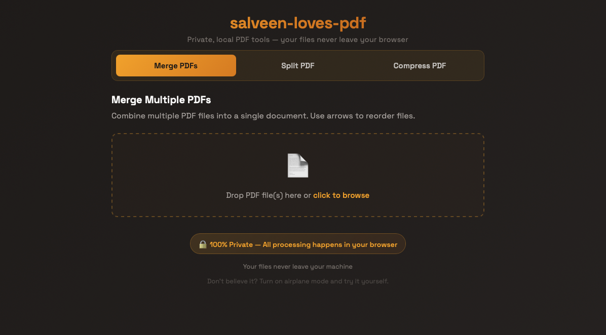

# 🔒 salveen-loves-pdf

> Built with **SvelteKit + TypeScript** — runs entirely in the browser, no backend.

I built this because I wasn't comfortable uploading sensitive documents — passports, bank statements — to third-party servers.

Everything runs in your browser. Nothing is sent to a server. Works in airplane mode.

🌐 **Live at [salveen-loves-pdf.vercel.app](https://salveen-loves-pdf.vercel.app)**



## Tech stack

**SvelteKit + TypeScript**. PDF processing is done entirely client-side using [pdf-lib](https://pdf-lib.js.org/) — no backend, no server, no file uploads.

## Run locally

```bash
git clone https://github.com/salveen/salveen-loves-pdf.git
cd salveen-loves-pdf
npm install
npm run dev
```

Then open `http://localhost:5173` in your browser.

## Build & preview

```bash
npm run build
npm run preview
```
